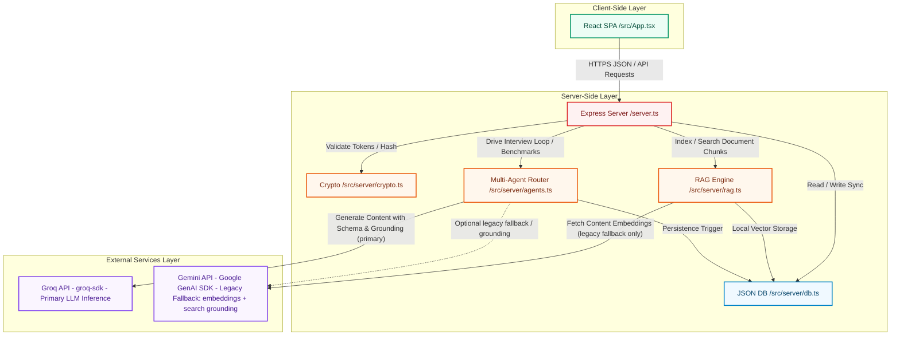

# Architectural Specification & Design

This document details the software architecture of the **Adversarial Interview Coach**, describing the subsystem structures, physical data models, API topologies, and information flow boundaries.

---

## 1. Subsystem Architecture Map

The following Mermaid diagram maps the real components of the application, their imports, file boundaries, and physical communication layers:



---

## 2. Component Specifications

### 2.1 Client-Side Layer (`/src/App.tsx`)
A responsive, desktop-first single-page application built on **React 18+** and **Vite**, styled with **Tailwind CSS**, and utilizing **Lucide React** for icons. It governs three visual operational phases:
1. **User Authentication Portal**: Simple form toggle supporting secure signup and login.
2. **Setup and Document Configuration**: Session customization interface. Candidates select difficulty behavior (adaptive/fixed), focus topics, role descriptions, and upload PDFs, DOCX, or text files for RAG processing.
3. **Live Active Session Interface**: Real-time interactive terminal displaying interviewer questions, candidate audio-to-text or typed answers, hint retrieval utilities, real-time coaching/evaluation breakdowns, and final reports with comparative session grids and printable PDF export pages.

### 2.2 Server-Side Controller (`/server.ts`)
The core monolithic Express controller governing network request parsing, media routing, session loops, security gates, and SPA static assets. It binds to port `3000` on host `0.0.0.0` for containerized ingress. Features include:
- **Fallback Avoidance**: Strictly intercepts `/api/*` requests, preventing default single-page app fallbacks from serving `index.html` to API clients.
- **Multipart Document Parser**: Intercepts documents using `multer` with in-memory buffers. Inspects file magic bytes (e.g. `%PDF` for PDF, `504b0304` for ZIP/DOCX) to prevent malicious extension spoofing, extracting clean texts using specialized parsers.

### 2.3 Authentication & Cryptographic Module (`/src/server/crypto.ts`)
An offline, high-speed, mathematical security sub-layer protecting user passwords and sessions without database-driven secret validation.
- **Password Hashing**: Implements **PBKDF2** with a unique 16-byte random salt, executing `1000` iterations over **SHA-512** to yield secure `:split` hash signatures.
- **Password Verification**: Safeguards against timing side-channel attacks by evaluating hashes through Node’s native, constant-time `crypto.timingSafeEqual`.
- **Custom Token Session Layer**: Compiles and verifies lightweight, stateless, tamper-proof **HMAC-SHA256 JWT tokens**. Tokens are generated via base64url serialization with sub-second expiration boundaries, keeping authentication decentralized.

### 2.4 Vector Search and Chunking RAG Subsystem (`/src/server/rag.ts`)
A customized retrieval-augmented generation engine working over in-memory local state collections.
- **Custom Text Splitter**: Employs a robust recursive character-splitting algorithm dividing files into fixed-size chunks (e.g. 600 characters with 100-character overlaps) by cycling paragraph, line, word, and character boundaries.
- **Embedding Generation**: Groq does not currently expose a first-party embeddings endpoint, so this subsystem defaults to a lightweight local/open embedding model for converting text chunks into vectors. The legacy `@google/genai` SDK path (`gemini-embedding-2-preview`, 768-dimension vectors) remains wired in as an **optional fallback**, activated only when `GEMINI_API_KEY` is present and the local embedding path is disabled.
- **Vector Search Engine**: Calculates similarity using a lightweight TypeScript **Cosine Similarity** formula. In-memory embeddings are filtered per-session, sorted by relevance score, and the top relevant nodes are injected as prompt anchors.

### 2.5 Multi-Agent System (`/src/server/agents.ts`)
A cluster of 8 task-oriented LLM and routing agents powered primarily by **Groq-hosted models** (e.g. Llama 3.x / Mixtral via `groq-sdk`), with the legacy `gemini-3.5-flash` path retained purely as a fallback if `GROQ_API_KEY` is absent:
1. **Industry Benchmark Agent**: Synthesizes standard expectations and trending skills for targeted roles using Groq inference. Native **Google Search Grounding** is not available on Groq, so live web-grounded benchmarking is only available through the optional legacy Gemini fallback path.
2. **Interviewer Agent**: Pulls RAG context, matches difficulty modes, and builds adversarial questions via Groq. Includes prompt-injection shields to prevent uploaded CV text from executing jailbreaks.
3. **Evaluator Agent**: Quantifies candidate output on a 10-point scale across accuracy, completeness, clarity, relevance, and example usage.
4. **Coach Agent**: Delivers encouraging feedback, highlighting specific strengths, gaps, and suggesting remedial study lists.
5. **Router Agent**: Adjusts interview difficulty dynamically based on rolling score evaluations.
6. **Report Generator**: Combines session responses, computes final percentages, averages pressure indexes, and saves reports.
7. **Adversarial Follow-Up Agent**: Introduces pointed, critical challenges based on candidate responses.
8. **Follow-Up Evaluator**: Quantifies composure, tech-depth, and response quality under direct pushback.

All eight agents route through a shared provider resolver: **Groq (primary) → Gemini (legacy fallback, if configured) → static Mock dataset**, so agent logic itself is provider-agnostic.

### 2.6 Persistence Database Layer (`/src/server/db.ts`)
A lightweight, transactional, synchronous JSON file-system database writing directly to `/data/db.json`. It coordinates tables as native in-memory arrays and persists mutations sequentially. Safe cascading deletions clear user session and embedding data to protect user privacy.

---

## 3. Communication and Data Flow Model

### 3.1 Authentication Handshake
```
[Client App] ---> (Submit Email & Password) ---> [Express Server]
                                                       |
                                            (Query User by Email)
                                                       |
                                                       v
[Express Server] <--- (Salt & DB Password Hash) <--- [JSON DB]
       |
  (Verify via PBKDF2 & timingSafeEqual)
       |
       +---> [Success] ---> (Generate Custom HMAC Token) ---> [Client Cookie]
```

### 3.2 Retrieval-Augmented Generation Ingestion
```
[Client App] ---> (Upload CV/JD via Multer) ---> [Express Server]
                                                       |
                                            (Verify Magic Bytes)
                                                       |
                                               (Parse File Text)
                                                       |
                                               (Recursive Split)
                                                       |
                                                       v
[JSON DB] <--- (Save Vectors & Text Nodes) <--- (Get Embeddings via Local Model, or Gemini legacy fallback)
```

### 3.3 Active Interview Question Turn
```
[Client Trigger] ---> [Express Server] ---> (Retrieve Next Topic from Benchmarks)
                                                       |
                                            (Query RAG Vector Match)
                                                       |
                                                       v
[Client UI] <--- (Render Question JSON) <--- (Generate Interview Question JSON via Groq, legacy Gemini fallback if unavailable)
```