# Session Lifecycle & Workflow Engine

This specification details the lifecycle of an interview session, detailing the path from setup to evaluation, dynamic routing, adaptive calibration, adversarial follow-ups, and compilation.

---

## 1. Interview Session Lifecycle Map

The workflow follows a state-machine topology managed inside the database and navigated via API transitions:

```mermaid
stateDiagram-v2
    [*] --> SetupState : Authenticate & Create Session
    
    state SetupState {
        [*] --> EnterParameters : Enter Role, Type, & Focus Topics
        EnterParameters --> UploadDocuments : Upload Job Description & Resume
        UploadDocuments --> RunGapAnalysis : Compare JD vs CV (Groq API)
        RunGapAnalysis --> FetchIndustryBenchmark : Synthesize standard bar (Groq API; legacy Gemini fallback used only for live Google Search Grounding)
    }

    SetupState --> ActiveInterviewing : Initialize Session / First Question
    
    state ActiveInterviewing {
        [*] --> RenderActiveQuestion : Pull active question or request new one
        RenderActiveQuestion --> AwaitingResponse : Display input and optional Hint Request
        AwaitingResponse --> RequestHint : User clicks "Request Hint"
        RequestHint --> AwaitingResponse : Deduct 1 point from score & display Hint
        AwaitingResponse --> SubmitResponse : User submits Answer
        
        state SubmitResponse <<choice>>
        SubmitResponse --> ProcessFollowup : If Session.awaitingFollowup is TRUE
        SubmitResponse --> ProcessStandard : If Session.awaitingFollowup is FALSE
        
        state ProcessStandard {
            [*] --> RunEvaluatorAndCoach : Analyze answer via LLM
            RunEvaluatorAndCoach --> SaveMetrics : Save scores & feed to local storage
            SaveMetrics --> CheckFollowupCondition : Is Score >= 7 OR 40% Random Chance?
        }
        
        state CheckFollowupCondition <<choice>>
        CheckFollowupCondition --> GenerateAdversarial : Yes (Trigger Follow-Up)
        CheckFollowupCondition --> AdvanceNormalTurn : No (No Follow-Up)
        
        GenerateAdversarial --> SetAwaitingFollowup : Create child question, set session.awaitingFollowup = TRUE
        SetAwaitingFollowup --> RenderActiveQuestion
        
        ProcessFollowup --> RunFollowUpEvaluator : Run Pressure Evaluation
        RunFollowUpEvaluator --> SaveFollowupMetrics : Save pressure scores and clear flag
        SaveFollowupMetrics --> AdvanceNormalTurn
        
        AdvanceNormalTurn --> CheckRemainingTurns : turnCount + 1
        
        state CheckRemainingTurns <<choice>>
        CheckRemainingTurns --> RenderActiveQuestion : turnCount < maxTurns
        CheckRemainingTurns --> FinalReportTrigger : turnCount >= maxTurns
    }

    ActiveInterviewing --> ReportGeneration : Complete Session
    ActiveInterviewing --> ReportGeneration : Force Early End via User Action

    state ReportGeneration {
        [*] --> DeleteUnanswered : Remove trailing questions
        DeleteUnanswered --> CalculateAggregateScores : Compute overall percentage and pressure scores
        CalculateAggregateScores --> InvokeReportGenerator : Synthesize strengths, gaps, and remediation
        InvokeReportGenerator --> SaveReportAndComplete : Write Report to JSON DB
    }

    ReportGeneration --> ExportState : Report Ready
    
    state ExportState {
        [*] --> DisplayVisualDashboard : Render Interactive Graphs & Recommendations
        DisplayVisualDashboard --> DownloadPDF : Request streaming PDF fallback via pdfkit
        DisplayVisualDashboard --> ComparePerformance : Contrast with previous sessions
    }

    ExportState --> [*]
```

---

## 2. Operational Phase Details

### 2.1 Initialization & Pre-Processing (Setup State)
1. **User Request**: The user initiates session creation via `POST /api/sessions`. They submit the target `role`, `type` (`technical`, `behavioral`, or `mixed`), `maxTurns` (between 3 and 10), and custom `focusTopics` (optional).
2. **Document Ingestion**: Job Descriptions (JD) and Resumes are uploaded to `POST /api/upload-document`. Text is parsed, checked for magic bytes, and written to RAG storage using `indexDocument()` in `/src/server/rag.ts`.
3. **LLM Gap Analysis**: A comparative assessment is executed via `gapAnalysis()`, powered by Groq's primary inference path, mapping the candidate's CV highlights directly against core JD expectations to populate the dashboard metrics prior to commencing the interview.
4. **Role Benchmarking**: The `runIndustryBenchmark` agent synthesizes a baseline list of expectation bars, standard toolsets, and key technical indicators using Groq by default. Because Groq does not offer a native web-search grounding feature, live Google Search Grounding is only available when the legacy Gemini fallback path is engaged (i.e. `GEMINI_API_KEY` is configured and Groq is unavailable, or the fallback is explicitly enabled); otherwise benchmarking relies on the model's trained knowledge rather than live search results.

### 2.2 Active Question & Answer Iteration
1. **Interviewer Generation**: `GET /api/sessions/:id/question` invokes the Interviewer Agent. If no question exists for the current index, a new one is built by querying the RAG database for matching topics, calibrating difficulty levels ("easy", "medium", "hard"), and injecting context safeguards.
2. **Hint Support Gate**: Candidates can issue `POST /api/sessions/:id/hint` to receive technical guidance. The system logs a `hintRequested: true` boolean on the active question record, applying a strict **-1.0 point penalty** to the question's ultimate composite score.
3. **Submission Evaluator Route**: Submitting a response triggers `POST /api/sessions/:id/answer`. 
   - **Case A: Standard Response**:
     The **Evaluator Agent** returns detailed metric arrays. The **Coach Agent** compiles strengths, gaps, and remediation links. 
   - **Adversarial Follow-Up Decision Matrix**:
     If the candidate's overall score on a standard question is **>= 7.0**, or if a **40% random roll** succeeds, the engine interrupts normal progression. The **Adversarial Follow-Up Agent** produces a highly targeted challenge, establishing a parent-child relationship via `isFollowup: true` and setting `session.awaitingFollowup: true`.
   - **Case B: Follow-Up Response**:
     If `session.awaitingFollowup` was `true`, the incoming submission is treated as a high-pressure challenge response. The **Follow-Up Evaluator Agent** scores composure, resilience, and depth on a `pressure_handling` scale. This result is appended to the session’s `followupHistory` and normal routing resumes.

### 2.3 Difficulty Calibration (Adaptive Calibration Engine)
After each non-follow-up question cycle, the **Router Agent** analyzes the candidate's score:
- **Escalation (Score >= 8/10)**: Elevates the session difficulty (`easy` -> `medium` -> `hard`).
- **Remediation (Score < 5/10)**: Lowers difficulty to prevent frustration and map foundation gaps (`hard` -> `medium` -> `easy`).
- **Steady State (5 <= Score < 8)**: Maintained for consistency.

### 2.4 Session Completion and Synthesis
- **Graceful Termination**: Commences automatically once `turnCount` reaches `maxTurns`.
- **Preemptive Exit**: Triggered via `POST /api/sessions/:id/end-early`. It deletes unresolved questions, aligns the final `turnCount` to completed questions, aggregates performance metrics, and triggers report compiling.
- **Report Generation**: The `runReportGenerator` synthesizes overall percentages, computes alignment scales, maps aggregated strengths and gaps, averages pressure resilience benchmarks, and persists a `Report` node into `/data/db.json`.
- **Exporting PDF**: Candidates can call `GET /api/reports/:sessionId/pdf` which pipes a styled, double-pass, table-gridded binary stream directly to client browsers using `pdfkit`.